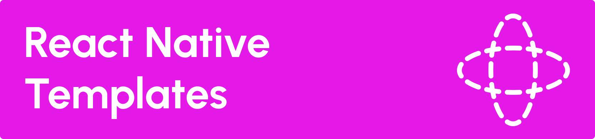

Your UI, defined with any data source

- Modular Data Sources - use the websocket data source or build your own
- Custom Component Suites - use the Rise components based on Tamagui, or build your own
- References - Components can refer to other data keys
- Safety - components validate their own props. Avoid crashes, even with bad data
- Rise Remote - Out-of-the box client app for you to build custom experiences quickly
- Extensible Events
- WS Server - Build custom apps entirely on the server

> [!WARNING]  
> This repo is a WORK IN PROGRESS. Please, do not use this yet! At the moment, we would welcome contributors but we cannot support any consumers of the system. For now, you can view this repo as inspiration for how easy and powerful it is to leverage server-driven UI.

This repo contains the following packages:

- `packages/react` - RRise Tools core library
- `packages/tamagui` - Component library based on Tamagui to use with RRise Tools
- `packages/kit` - Component library used by the Playground 
- `packages/ws-client` - Websocket client to use with the Websocket server
- `packages/ws-server` - Websocket server 

As well as the following applications:
- `apps/mobile` - Mobile application to display UI from any remote data source or QR code
- `apps/rise-marketing` - Landing page for the Rise App
- `example/demo` - Demo server with example experiences available in the Rise Mobile
- `example/server` and `example/dashboard` - Art project server and preview web application  

## Overview

RRise Tools (RNT) can be described with 3 core primitives:

- Component Library of UI your client can render
- Data Source where your templates will load+subscribe to data
- Template component to render in the app, using the data source and component library

## Template Component

This will be published from `@final-ui/react`

```ts
import { Template } from '@final-ui/react`

// then, render it:

<Template
  components={myComponents}
  dataSource={dataSource}
/>
```

The Template component accepts the following props:

### `components`

The component library object, with all the component that the data can request to be displayed

### `dataSource`

The store of data that will define the views for rendering

### `onEvent`

To handle events that come from your rendered components

### `path`

Specify the path within the dataSource to render. Useful if you share one data source with several `<Template>`s

## Component Library

The components are an object that you pass to the template. Your library could be defined as:

```ts
import { View, Text } from 'react-native'

const components = {
  View: { component: View },
  Text: { component: Text },
}
```

Each component definition may also have a `validator` which is a function that accepts the props from the dataSource and returns the props if they are valid. If they are invalid, an error is thrown. This is in place to prevent crashes in situations where invalid props are passed into your components.

## Data Sources

The template uses "stores" of data to decide what UI to render. RNT is entirely network-agnostic, but it is designed for realtime scenarios where your server can push updates to the UI.

The `DataSource` is an object with one mandatory function to returns a store for a given path. If no `path` prop was provided to the `<Template>`, the root path of "" (empty string) will be used to query for the UI data.

```ts
type DataSource = {
  get: (key: string) => Store
}
```

A Store allows the template to get and subscribe to data changes:

```ts
export type Store<V = unknown> = {
  get: () => V
  subscribe: (handler: () => void) => () => void
}
```

### WebSocket Data Source

This is a reference implementation of the data source, built with websockets. The server allows you to define UI that will be updated in realtime from the client.

## Component Data

This is the base functionality of RNT, to specify which components will be rendered in your `<Template>`

```ts
{
  $: 'component',
  key: 'myRow', // used to specify sort order
  component: 'XStack', // this component must be defined in your Component Library
  props: {
    gap: '$2'
  },
  children: [
    {
      $: 'component',
      component: 'Button',
      children: 'Tap A'
    },
    {
      $: 'component',
      component: 'Button',
      children: 'Tap B'
    }
  ]
}
```

## Ref Data

Your store data can include references to data from other stores.

```ts
{
  $: 'ref',
  key: 'myOtherThing',
  ref: 'otherPath'
}
```

Refs can be specified as arrays, to look up data within objects and arrays of the other path value:

```ts
{
  $: 'ref',
  key: 'myOtherThing',
  ref: ['otherPath', 'key1', 0, 'key3']
}
```

You can specify Refs as children components or props of any component. (Maybe even deep props?)

## Events

In order to listen to events trigerred by given components, you have to pass a special object as a prop to an event handler:

```ts
{
  $: 'component',
  component: 'TouchableOpacity',
  props: {
    onPress: {
      $: 'event',
    }
  },
```

You can then listen to the events with the `onEvent` prop on `<Template>`.

```tsx
<Template
  components={components}
  dataSource={dataSource} 
  onEvent={(event) => {
    // this will be : "TouchableOpacity"
    console.log(event.target.component)
  }} 
/>
```

The event object contains a bunch of helpful properties to let you handle events more efficiently:

```ts
type TemplateEvent<T = any, K = any> = {
  target: {
    key?: string
    path: string
    component: string
  }
  name: string
  action: T
  payload: K
}
```

### `target`

Describes the component that trigerred the event:
- `key` - optional, present only if it was explicitly set by you
- `path` - path to the component in a rendered tree 
- `component` - name of the component that trigerred the event, e.g. "TouchableOpacity"

### `name`

Name of the event handler, e.g. `onPress`.

### `payload`

First argument that was passed to the event handler, shape is specific to the component that trigerred the event. Note that native events are not serialised and passed. For `TouchableOpacity`'s `onPress`, you will receive `[native code]` instead.

### `action`

Optional field that can be helpful to differntiate events within the application or trigger certain actions. Its shape is opaque to this library and can be set to anything that works for your use case.

For example, it can be a string, e.g. `navigation:goBack` or an array: `['navigation', 'goBack']`. 

Then, in the `onEvent` handler, you may want to do as follows:
```tsx
<Template
  components={components}
  dataSource={dataSource} 
  onEvent={(event) => {
    // assumes event.dataState.action is an array
    if (event.dataState.action?.includes('navigation')) {
      return handleNavigationEvent(event)
    }
    handleGenericEvent(event)
  }} 
/>
```

## Built-in component libraries

### Tamagui Component library

Contains all Tamagui components to be used immediately with Rise Tools. 

### Rise Component Library

Contains more sophisticated components that are available in the Rise mobile app. It is mostly based on Tamagui. You may use it to reduce boilerplate required to e.g. define a select field with Tamagui.

## Rise App

This app will be used for my own purposes and will hopefully be published to the app stores soon. I see it as a "remote control" for arbitrary servers, such as controlling art projects or automating my home and work. As long as the server uses the `ws-source-server` and renders components from the Component Library, I can build new mobile experiences without shipping new apps through the app stores.

The Rise app allows the user to specify different "connections", which are WebSocket URLs that will define their UI.

Also, Rise supports navigation between different screens in the app. With a custom event definition such as `props: { onPress: [ 'navigate', 'myOtherPath' ] }`

## Contributing

Step 1. Checkout and run `npm install`

You can develop by running the Playground in the iOS simulator.

Step 2. `cd apps/mobile && npm start`

Then run the Websocket server, which is focused on the LED art project and various integrations.

Step 3. `cd example/server && npm start`

Finally, open up the mobile app and create new connection that points to the Websocket server.

> ![NOTE]
> If you are using VSCode, you can run a task: "Start all servers" to do all the above at once.

## Big TODOs:

- Publish the Playground to the iOS and Android app stores
- Publish packages to NPM under the `@final-ui` org
- Documentation
- Landing page
- API Reference
- Move lighting-related server code (`example`) to independent repo
- Improve type safety across the system
- Web support
