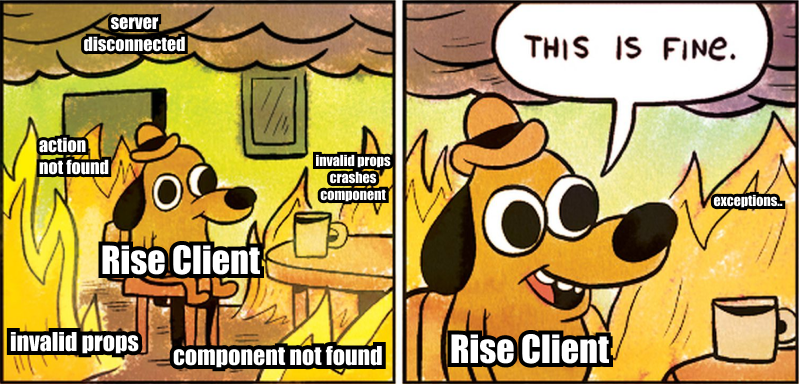

# Server Compatibility

Rise Tools (and most approaches to Server-Defined Rendering) introduces a class of issues where the server may attempt to render something that the client may not be able to handle.

We have a few techniques to catch these situations before they result in a broken interface, and generally you must wrap your components with a [React Error boundary](https://react.dev/reference/react/Component#catching-rendering-errors-with-an-error-boundary) to catch these exceptions.

> Note: this is an ongoing area of research and development. Dealing with incompatibility issues between server and client is a big issue!

## Missing Components

If a server attempts to render a component that is not defined on the client, `<Rise />` will throw an error.

## Component Validators

Each component in the component library may specify a `validator` function which will take in the unsafe props from the server and return the type-safe props.

The validator may throw an error if the props cannot be safely used. This will result in the `<Rise />` component throwing an error that should be caught by your error boundary.

## Action Validators

Like components, action definitions should have a `validate` function which will take in an action and return the type safe action if it succeeds, and throw an error if the state is invalid. As soon as an action is recieved from the server, the validator will be called (even before the action handler is meant to be called).

Like before, if an error is thrown from an action validator, the error boundary must catch the resulting error that `<Rise />` will throw.

> Note: While component definitions have a `validator` function for their props, action definitions have a `validate` function. This is an inconsitency that we will address in a future alpha release of Rise React.

## Future Plans

In the future we will help you address these issues by providing you with a boundary component, allowing you to specify special UI that will be rendered when these issues are caught.

For most cases, if a validation error happens it means the server code is referencing components that are not available from older clients. So the user should be prompted to update their app, and the problem should go away for them (assuming the developer hasn't made additional errors).

We also plan to improve the validators of the [Rise Kit](/docs/kit) which are not yet.

You are invited to help us solve these issues, your [contributions](/docs/contributors) would be greatly appreciated!