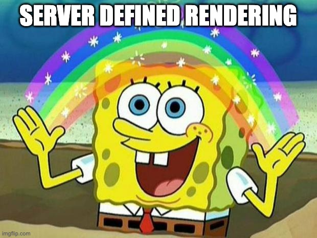
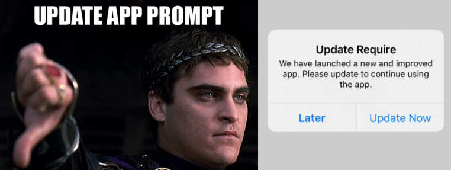

---
---

# Introduction

Rise Tools allows you to tweak and expand the UI of your React Native app while it is in production, without re-building or re-deploying your code.

It unlocks a technique called "Server Defined Rendering"



## Server Defined Rendering

SDR is any approach where your server will provide a UI specification for your client application to render.

The web provides SDR by default: HTML defines the document structure that your browser will render (although your client app code may get "stale" when the server has updates and the user has not refreshed!)

So this technique is mostly applicable to mobile applications which may not always be updated immediately by the user. You may wish to provide a new experience without showing a prompt requesting users to upgrade.



You can think of Rise Tools like a simple browser engine that helps you load data from the server and provide custom DOM components to your users. 

## Rise Tools Architecture

Any Rise app has a client and a server, with a pre-defined protocol between them. You can [learn more about the protocol](/docs/server-spec), or read on to understand what tools we provide out of the box: 

### Client Rise Component

Our client component is a simple React component:

```tsx
<Rise
  components={components}
  modelSource={modelSource}
/>
```

There are two critical ingredients for this recipe: a component library and a model source.

### Component Library

You are encouraged to bring your own components to the Rise client in your app, but the Tools includes [Rise Kit](/docs/kit), a growing suite of components that are ready to use out of the box.

### Model Source

The models are responsible for defining the data and 

### Actions

What if you want the client to have some interactive behavior without talking to the server? Or what if the server wants to send some follow-up behavior back to your client code? Maybe you want to follow links, give the user haptic feedback, or show a toast when the server succeeds.

This can be accomplished by passing an object of actions into the Rise client:

```tsx
<Rise
  components={components}
  modelSource={modelSource}
  actions={{
    goToTheMoon: {
        action: () => {
            // TODO: implement moon launch
        }
    }
  }}
/>
```

Now your server-defined components (such as a button or anything with an event handler) can `goToTheMoon()`!

The Kit also includes several actions such as [linking](/docs/kit/linking) and [haptics](/docs/kit/haptics).

### Server Libraries


## Rise Playground

To test out your server code, you can download the Playground mobile app, which features the full Rise Kit suite of actions and components.

The app connects to your custom server with URL or QR Code, and will present a custom mobile experience for your friends and colleagues.

If you have a hobby project, or if you want to create an internal tool for your compnay, you might not need to build a client app at all!

## Get Started

There is so much more to talk about, such as [navigation](/docs/guides/navigation) and [creating safe interactions with the server](/docs/guides/server-compatibility), but at this point you probably want to [get started](./getting-started)!