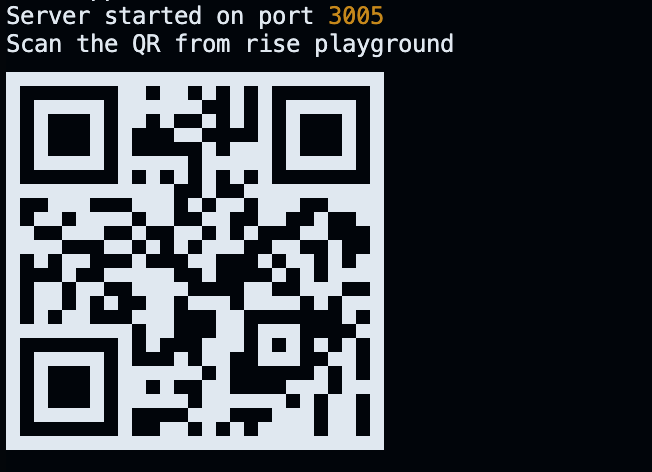
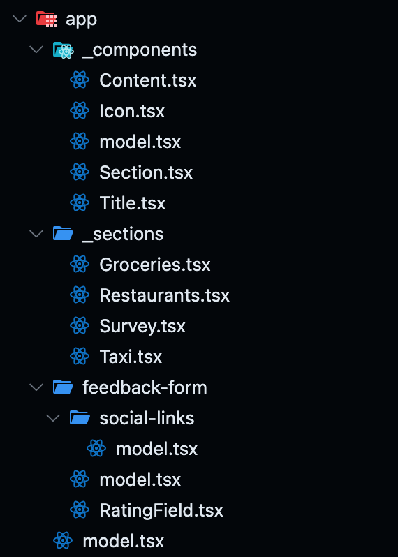
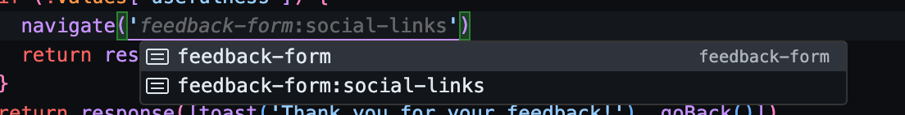

#  Rise Start

> A CLI tool for rise-tools


- [Rise Start](#rise-start)
    - [QR Code for smooth Playground access](#qr-code-for-smooth-playground-access)
    - [File-based Router](#file-based-router)
    - [Type-safe Navigation](#type-safe-navigation)

---

### QR Code for smooth Playground access

- CLI-based interface for easy access
- Hot-reload functionality for specific models that are changed
- QR code generation for quick mobile device testing



---

### File-based Router

- Intuitive file structure similar to Next.js projects
- Use `model.tsx` to define routes instead of `page.tsx`
- Private routes can be created by prefixing filenames with an underscore




The models generated from the above structure will be:


```ts
const models = {
    '': string
    'feedback-form': string
    'feedback-form:social-links': string
}
```


---

### Type-safe Navigation

- Leverage TypeScript for type-safe model navigation
- Autocomplete and error checking for model paths




[Checkout the dev server code here](./script/server.ts)
